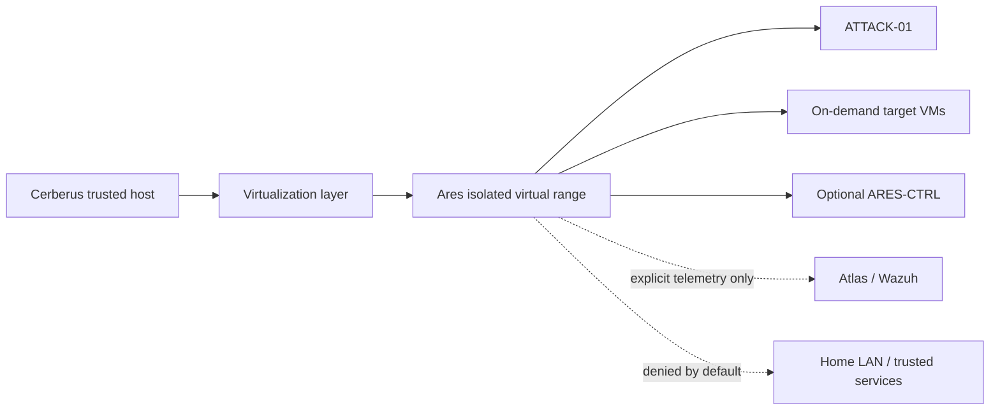

# Project Ares — Cerberus Virtual Cyber Range

> **Status: REDESIGNED — October 5, 2026**
>
> Project Ares is no longer a dedicated physical system. Ares is an on-demand, isolated virtual cyber range hosted on Project Cerberus. The original Ares v1 Windows 10-era PC conversion and the planned Ares v2 hardware build are retired.

   

## Mission

Ares exists only when a security-engineering exercise needs controlled offensive activity. It provides disposable attacker and target VMs, isolated virtual networking, snapshots, repeatable reset workflows, and bounded telemetry paths to the Cyber Operations Center.

Ares helps answer three questions:

1. Did the security control detect the behavior?
2. Did the response or hardening change work?
3. Can the test be repeated safely and produce useful evidence?

Ares is not a separate pentesting specialization, permanent multi-VM lab, or reason to purchase another computer.

## Scope

Ares supports focused exercises such as:

- Active Directory and identity-security validation
- Windows and Linux hardening verification
- Wazuh/SIEM detection engineering
- Network and credential-control validation
- Web/API security testing when it supports software being built
- Controlled attack-to-detect-to-remediate-to-retest workflows

Deep malware detonation, indiscriminate exploit practice, large permanent vulnerable ranges, and labs without a clear engineering objective are out of scope.

## Hosting model

Ares runs inside **Project Cerberus**, the trusted Linux Mint Cinnamon engineering workstation. The virtualization stack will be selected and documented as part of the Cerberus implementation; this repository does not prematurely lock a hypervisor.

The Ares boundary is logical but explicit:

- dedicated virtual networks;
- deny-by-default routing to the home LAN and trusted Cerberus services;
- no unrestricted Internet access;
- temporary, minimum-required telemetry paths to Atlas/Wazuh;
- disposable or snapshot-backed target VMs;
- no production credentials or personal data;
- range powered down when not in use.

## On-demand guest catalog

| Guest | Role | Usage |
|---|---|---|
| ATTACK-01 | Kali operator VM | Started only for controlled offensive testing |
| AD-DC-01 | AD DS/DNS | Identity-security scenarios |
| WIN-01 | Windows endpoint | Endpoint/identity/detection scenarios |
| WIN-02 | Optional second endpoint | Lateral-movement scenarios only when required |
| WEB-01 | Vulnerable web/API target | Application-security scenarios |
| LINUX-01 | Linux target | Linux/network/detection scenarios |
| ARES-CTRL | Optional orchestration/evidence service | Added only when automation provides real value |

Not every guest runs at once and not every guest needs to exist permanently.

## Engineering workflow

```text
Define engineering question
        ↓
Start only required Ares VMs
        ↓
Validate isolation + telemetry
        ↓
Perform controlled test
        ↓
Atlas / Wazuh observes telemetry
        ↓
Investigate + improve detection/control
        ↓
Retest
        ↓
Capture evidence
        ↓
Reset / destroy lab state
```

## Architecture



See [Architecture](docs/architecture.md), [network and security design](docs/network-security.md), and [roadmap](docs/roadmap.md).

## Repository map

```text
docs/                 Architecture, virtual resources, inventory, safety, roadmap
scenarios/            Focused engineering validation scenarios
runbooks/             Operator and emergency procedures
playbooks/            Defensive validation playbooks
reports/              Sanitized after-action evidence
automation/           Optional orchestration where repetition justifies it
dashboard/            Optional interface if it later provides real value
```

## Delivery approach

Ares follows a **need-driven** model. There is no requirement to build every range or complete every possible lab. A scenario is added only when it materially supports Security Engineering, AI/security integration, COC validation, or a specific learning objective.

## Safety statement

This project is for systems the operator owns or is explicitly authorized to test. Intentionally vulnerable guests and adversary tooling remain isolated from trusted networks by default. Synthetic identities and test data are used throughout. See [SECURITY.md](SECURITY.md).

## Hardware decision

**No dedicated Ares hardware will be purchased or built.** The former Windows 10-era PC is unassigned reusable hardware and is not part of Project Ares. Ares v2 hardware plans are cancelled.

## License

Documentation and original code are released under the [MIT License](LICENSE). Third-party tools, operating systems, and vulnerable applications retain their own licenses.
